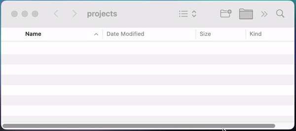

# MacOS Tweaks

This repository contains various tweaks for macOS to enhance user experience.

[TOC]

## Finder Toolbar

These scripts are designed to be placed in the Finder Toolbar, providing quick access to various operations, such as creating a new file in the current folder.

### How to Apply Tweaks:

1. **Download**: Start by getting your hands on the desired script.
2. **Set Permissions**: Let's make sure it has the right to work its magic by setting permissions using this command: `chmod +x FILEPATH`.
3. **Run the Script**: Execute the script. This will pop open a directory with the compiled app.
4. **Drag to Toolbar**: Hold down the Command key and drag the app into your Finder Toolbar.

Done! You're now just one toolbar click away from your desired result.

### Available Tweaks:

Available tweaks:

* [CreateFile](finder_toolbar/add_CreateFile.sh): Creates a new file in the Finder.
* [OpenTerminal](finder_toolbar/add_OpenTerminal.sh): Opens the Terminal and sets its working directory to the current Finder window.
* [OpenVisualStudioCode](finder_toolbar/add_OpenVisualStudioCode.sh): Opens the Visual Studio Code from a specific directory.
* [CreateProjectFolder](finder_toolbar/add_CreateProjectFolder.sh): Creates named project folder based on the current date, and includes an empty README.md file inside it.

## Misc

* [Disable Dark Theme in some apps](misc/disable_dark_theme.sh): Do you like dark theme on macOS but still prefer light theme in other apps? This script disables dark theme in Finder and other apps.